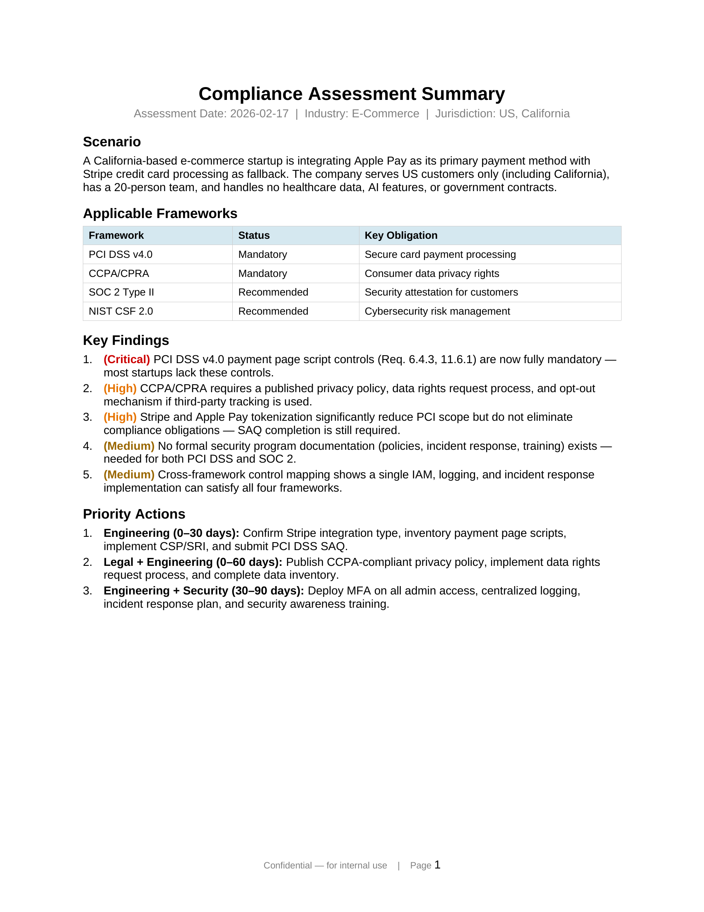
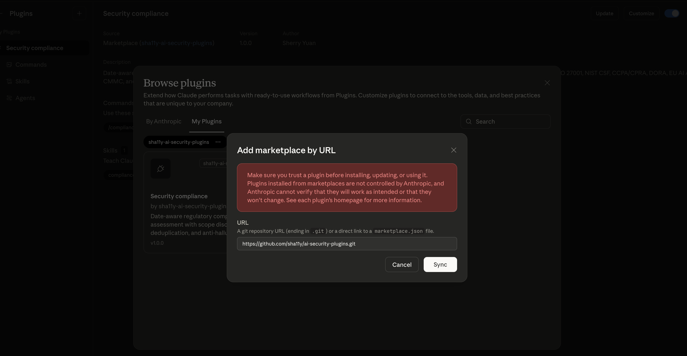

# security-compliance

**An AI identity-architecture validator paired with Claude Cowork/Code.**

Describe your identity layer — CIAM model, RBAC/ABAC design, OAuth/OIDC/SAML federation, SCIM provisioning, workload-identity scheme, ephemeral-credential issuance — and the engine maps it to applicable regulatory frameworks, surfaces identity-specific compliance gaps at the control-family level, and recommends single-implementation control consolidation so one identity architecture covers multiple frameworks instead of three parallel audit workstreams.

Covers **11 regulatory frameworks**: GDPR, HIPAA, SOC 2, PCI DSS, ISO 27001, NIST CSF (incl. NIST 800-53 IA family), CCPA/CPRA, DORA, EU AI Act, CMMC, and FedRAMP.

> **Why this exists.** Generic compliance tools (Vanta, Drata, Conveyor) collect evidence for frameworks already chosen and don't reason about identity protocol design. They don't tell a senior IAM architect whether a specific OIDC workload-identity federation design — token shape, lifetime, audience binding, key rotation cadence — satisfies SOC 2 CC6 + ISO 27001 A.5 + GDPR Art. 32 + DORA Art. 9(4)(c)-(d) with **one** control implementation, or three. This engine is built for that question. The four-framework wedge above is the headline; broader coverage (HIPAA, PCI DSS, NIST CSF, CCPA/CPRA, EU AI Act, CMMC, FedRAMP) is supported by the same engine for adjacent scenarios.

**Author:** [Sherry Yuan](https://github.com/sherryyuan678) | [LinkedIn](https://www.linkedin.com/in/sherryyuan/)

---

## What It Does

You describe your identity-and-access design — protocols in use (OAuth 2.x / OIDC / SAML / SCIM), human-vs-machine identity boundaries, RBAC/ABAC model, federation pattern, credential lifetimes, customer/tenant data scope — and the plugin gives you:

- **Which frameworks apply** to the identity layer (and which don't)
- **A cross-framework control map** keyed on identity control families (authentication, authorization, identifier management, credential lifecycle, session control, access-review, segregation of duties, machine-identity) — one implementation satisfying multiple regulations
- **Identity-specific gap analysis** ranked by severity (e.g. "OIDC token lifetime exceeds NIST IA-5(1) rotation guidance"; "no SCIM-driven deprovisioning for SOC 2 CC6.3"; "workload identity lacks strong access-control evidence under DORA Art. 9(4)(c)-(d)")
- **Technical controls** for your IAM/platform engineering team (protocol choices, token shapes, key rotation, audience binding, scope design)
- **Policy templates** for your legal/compliance team
- **An evidence ledger** for auditors mapping each identity control to its source regulation clause

---

## Commands

| Command | Description |
|---|---|
| `/security-compliance:spot-check` | Quick single-turn compliance check for any business scenario. |
| `/security-compliance:compliance-check` | Full phased assessment producing 8 deliverable files with evidence ledger. |
| `/security-compliance:compliance-eval` | Run evaluation suites (for plugin developers and QA). |

### Options

| Option | Description |
|---|---|
| `--as-of YYYY-MM-DD` | Assess against framework versions effective as of this date. Defaults to today. |
| `--jurisdictions` | Comma-separated list (e.g., `US,US_CA,EU`). |
| `--industry` | Industry vertical (e.g., `healthcare-saas`, `fintech`, `govtech`). |
| `--strict-facts` | Every finding must trace back to a specific regulation section. |
| `--include-emerging` | Include frameworks not yet in force but relevant for planning. |

---

## Try It — Copy, Paste, Go

These are real-world scenarios you can run right now. Replace `{COMPANY}`, `{CLOUD_PROVIDER}`, `{PLATFORM}`, `{PAYMENT_PROVIDER}`, and `{PAYMENT_PROCESSOR}` with the actual company name you're assessing, selling to, or building for — the plugin handles the rest.

### Spot-checks (quick, single-turn)

**Flagship — Droplet OAuth Workload Identity Federation against the four-framework wedge:**

This scenario maps directly to DigitalOcean's published [`digitalocean-labs/droplet-oidc-poc`](https://github.com/digitalocean-labs/droplet-oidc-poc) — Aug 2024–Oct 2025 three-part series on secretless Droplet → Managed Database / Spaces access. If your design uses the same primitives (OAuth proxy issuing OIDC RSA JWTs, RFC 8693 token exchange, HCL-defined policies), this is the assessment you'd run before architecture review.

```
/security-compliance:spot-check Cloud platform serving regulated B2B SaaS
customers. Compute workloads (Droplets, Kubernetes pods on DOKS) reach
Managed Databases and Spaces object storage using OIDC-compliant RSA JWT
workload-identity tokens issued by an OAuth proxy, exchanged at a token-
exchange endpoint (RFC 8693) for 5-minute scoped access tokens governed by
HCL-defined roles and policies. Tokens are audience-bound to the team UUID;
asymmetric keys rotated on a 30-day cadence; no static secrets baked into
VM images. Validate this workload-identity architecture against the four-
framework identity wedge: SOC 2 CC6.1/CC6.7 (logical access + transmission),
ISO 27001 A.5.15/A.5.17/A.8.5 (access control, authentication information,
secure authentication), GDPR Art. 32 (encryption + access control as
integrity/confidentiality measures), and DORA Art. 9(4)(c)-(d) (logical
access + strong authentication + cryptographic key protection) plus
Art. 28-30 (ICT third-party arrangements). --as-of 2026-02-17
--jurisdictions EU,US --industry saas --strict-facts
```

Surfaces the audit-relevant questions the four-framework wedge cares about most: token lifetime/rotation alignment, audience-binding scope, key-rotation cadence vs strictest applicable clause, and a single evidence ledger that an EU DORA auditor, a SOC 2 examiner, and a GDPR DPA can each read against the same architecture diagram.

**CIAM with custom RBAC — DigitalOcean-style multi-tenant authorization:**

This scenario maps to DigitalOcean's [Custom Roles RBAC](https://www.digitalocean.com/blog/introducing-custom-roles) (June 2025) layered on [Okta OIDC SSO](https://www.digitalocean.com/blog/support-for-single-sign-on) (Sept 2025). Use it as a template for any platform shipping fine-grained customer authorization on top of an OIDC IdP federation.

```
/security-compliance:spot-check B2B cloud platform offering Droplets,
Managed Databases, Spaces, Kubernetes (DOKS), and App Platform to
AI-native customers. Customer-identity stack is OIDC SSO via Okta as IdP,
PKCE + state + nonce on the auth code flow, with custom roles layered on
top of the six predefined roles (Owner, Member, Modifier, Biller, Billing
Viewer, Resource Viewer) so admins can grant resource-scoped read/write
per service (e.g. read-only on Droplets + write on Kubernetes). SCIM 2.0
provisioning planned for joiner-mover-leaver automation. Validate this
CIAM + custom-RBAC design against the four-framework identity wedge:
SOC 2 CC6.1/CC6.2/CC6.3 (logical access, registration/authorization,
joiner-mover-leaver), ISO 27001 A.5.15/A.5.16/A.5.17/A.5.18 (access
control, identity management, authentication information, access rights),
GDPR Art. 32 + Art. 25 (security of processing + data protection by
design), and DORA Art. 9(4)(c) (logical access controls — least
privilege). --as-of 2026-02-17 --jurisdictions US,EU
--industry cloud-saas --strict-facts
```

Surfaces the CIAM-specific failure modes — role explosion that defeats SOC 2 CC6.1 least-privilege, SCIM JML deprovisioning gaps that show up under SOC 2 CC6.3 / ISO 27001 A.5.16 / DORA Art. 9(4)(c), and OIDC auth-code-flow choices (PKCE, state, nonce) that determine logical-access baseline conformance.

**Kubernetes workload identity — DOKS pod to Managed Database via projected SA token:**

```
/security-compliance:spot-check DOKS (managed Kubernetes) cluster running
multi-tenant customer workloads. Each pod uses a Kubernetes-projected
service-account token (audience: oidc.k8s.example) federated through an
OIDC trust to the platform OAuth issuer; the issuer exchanges the SA token
for a 5-minute scoped access token bound to the customer's team UUID,
authorized by HCL policy to read a specific Managed Database instance.
Pod-to-DB traffic is mTLS over the cluster's CNI. Validate this Kubernetes
workload-identity design against SOC 2 CC6.1/CC6.7 (logical access +
transmission), ISO 27001 A.5.15/A.5.17/A.8.4 (access control, authentication
information, access to source code — applies because SA tokens are
config), GDPR Art. 32 (confidentiality + integrity for tenant data), and
DORA Art. 9(4)(c)-(d) (logical access + strong auth) + Art. 28 (ICT third-
party arrangements between tenant and platform). --as-of 2026-02-17
--jurisdictions EU,US --industry cloud-saas --strict-facts
```

Adds K8s-specific gap analysis: SA-token audience tightness (cross-cluster confused-deputy risk), projected-token TTL alignment with the 5-minute scoped-token TTL (a common compliance miss), and CNI mTLS evidence capture that SOC 2 examiners and DORA auditors can both verify.

**Vendor due diligence — EU fintech evaluating a cloud provider:**

```
/security-compliance:spot-check We are an EU-licensed payment services provider
evaluating {CLOUD_PROVIDER} as our primary cloud infrastructure. We process
payment transactions for EU retail banks and will host all workloads in
{CLOUD_PROVIDER} EU regions. Our banking clients require us to demonstrate ICT
third-party risk management under DORA. We also process EU consumer PII and
accept credit card payments. --as-of 2026-02-17 --jurisdictions EU
--industry fintech
```

Surfaces DORA Art. 28-44 contractual requirements, cross-maps existing SOC 2/ISO 27001 certifications against DORA gaps, and scopes PCI DSS obligations — the analysis that takes weeks of legal review, in one command.

**GDPR exposure — ad platform integration for EU audiences:**

```
/security-compliance:spot-check EU-headquartered e-commerce company planning to
use {PLATFORM}'s advertising platform to target customers across EU member
states. We will share customer email lists for custom audience targeting and
install {PLATFORM}'s tracking pixel on our website to track conversions. Our
customer base is exclusively EU. No US customers, no healthcare data, no
financial services. --as-of 2026-02-17 --jurisdictions EU --industry ecommerce
```

Catches the joint controller determination (GDPR Art. 26), cross-border transfer risks, and the DPIA requirement — three issues most legal teams discover only after receiving a DPA inquiry.

**PCI DSS scope — evaluating a payment integration:**

```
/security-compliance:spot-check US California-based e-commerce startup planning
to integrate {PAYMENT_PROVIDER} as our primary payment method. We will also
accept direct credit card payments via {PAYMENT_PROCESSOR} as a fallback. We
serve US customers only, including California. No EU customers, no healthcare
data, no AI features, no government contracts. 20-person team.
--as-of 2026-02-17 --jurisdictions US_CA --industry ecommerce
```

Determines whether tokenized payments reduce your PCI scope from SAQ-D (300+ controls, $50-150K+ QSA assessment) to SAQ-A — the highest-leverage compliance finding for a startup.

**Sample output** from the command above (Apple Pay + Stripe, US/CA, e-commerce):



Each spot-check produces a detailed markdown report (`.compliance-reports/spot-check-YYYY-MM-DD.md`) and a one-page DOCX/PDF summary ready to hand to leadership. [Download the sample PDF](./docs/spot-check-sample-output.pdf).

### Full assessments (8-file deliverable set)

**AI system — EU AI Act + GDPR for a recommendation engine:**

```
/security-compliance:compliance-check {COMPANY}'s content recommendation system
serving 90M+ EU subscribers. The ML/AI engine processes viewing history, search
behavior, and engagement signals to generate personalized content rankings.
US-headquartered (California), EU subscribers across all member states.
Processes subscriber PII (name, email, viewing history, device info). Accepts
credit card and payment method data via payment processors. No healthcare data,
no government contracts. I am on {COMPANY}'s platform security team.
--as-of 2026-02-17 --jurisdictions US_CA,EU --industry saas --strict-facts
```

Correctly classifies the AI system under EU AI Act (limited risk, not high-risk — avoiding millions in unnecessary conformity assessment), then maps GDPR + CCPA + PCI DSS + SOC 2 into a unified control map with CI/CD integration points.

**Government healthcare cloud — FedRAMP High + HIPAA + CMMC:**

```
/security-compliance:compliance-check {COMPANY}'s government healthcare cloud
offering. Provides IaaS/PaaS services to US federal civilian and defense
healthcare agencies. Processes protected health information (PHI) for
government healthcare programs. FedRAMP High authorized environment.
US-headquartered (California). Serves US government customers only, no direct
EU consumer data processing in this offering. I am on {COMPANY}'s compliance
team. --as-of 2026-02-17 --jurisdictions US,US_CA --industry gov-cloud
--strict-facts
```

Shows that FedRAMP High is the superset — a single implementation covers ~85% of HIPAA Security Rule and substantially satisfies CMMC Level 2, with clearly identified gaps. One evidence set instead of three separate audit workstreams.

Each full assessment produces 8 files: applicability assessment, cross-framework control map, gap analysis, implementation roadmap, technical controls, policy templates, audit preparation package, and evidence ledger.

---

## Guardrails

- **Scope discipline.** Only reports on frameworks that actually apply to your scenario.
- **Anti-hallucination markers.** Items needing human verification are marked `REQUIRES VALIDATION` instead of guessed at.
- **Date-aware framework versions.** Resolves the correct version of each framework as of the date you specify.
- **Automatic output validation.** Hooks check for out-of-scope mentions, non-standard terminology, and missing sections.

---

## Installation

### Claude Cowork

In Claude Cowork, go to **Plugins** > **My Plugins** > **Add marketplace by URL** and enter:

```
https://github.com/sherryyuan678/ai-security-plugins.git
```

Then click **Sync** to install.



### Claude Code

```
/plugin marketplace add sherryyuan678/ai-security-plugins
/plugin install security-compliance@sherryyuan678-ai-security-plugins
```

### Prerequisite: document-skills plugin

The compliance commands generate Word document (.docx) summary reports. Install the document-skills plugin first:

```
/plugin marketplace add anthropics/skills
/plugin install document-skills@anthropic-agent-skills
```

Restart Claude Code after installation. A reminder will appear at session start if this dependency is missing.

### Requirements

- **Claude Code 1.0.33 or later**
- **Python 3.7+** on PATH (for validation hooks; the plugin works without Python, but hooks won't be active)

---

## Supported Frameworks

| Framework | Version | Effective Date |
|---|---|---|
| GDPR | Regulation (EU) 2016/679 | 2018-05-25 |
| HIPAA | HIPAA Privacy/Security/Breach Rules | 2005-04-20 |
| SOC 2 | AICPA Trust Services Criteria 2017 | 2017-01-01 |
| PCI DSS | PCI DSS v4.0 | 2022-03-31 |
| ISO 27001 | ISO/IEC 27001:2022 | 2022-10-25 |
| NIST CSF | NIST Cybersecurity Framework 2.0 | 2024-02-26 |
| CCPA/CPRA | CCPA as amended by CPRA regulations | 2023-01-01 |
| DORA | Regulation (EU) 2022/2554 | 2025-01-17 |
| EU AI Act | Regulation (EU) 2024/1689 | 2024-08-01 |
| CMMC | CMMC 2.0 Rulemaking Baseline | 2024-11-10 |
| FedRAMP | FedRAMP Rev 5 baseline program guidance | 2023-01-01 |

---

## License

MIT

---

## Disclaimer

> This plugin is provided for **informational and educational purposes only** and does **not** constitute legal, regulatory, compliance, or professional advice of any kind. The output generated by this tool should **not** be relied upon as a substitute for consultation with qualified legal counsel, compliance professionals, or other appropriate advisors. No attorney-client relationship, fiduciary duty, or professional engagement is created by using this plugin. The authors and contributors make **no representations or warranties**, express or implied, regarding the accuracy, completeness, currentness, or applicability of any information produced. Regulatory frameworks change frequently; the information provided may not reflect the most recent legal developments. **You assume all risk** associated with the use of this tool and its output. Always seek independent professional advice tailored to your specific circumstances before making compliance or legal decisions.
